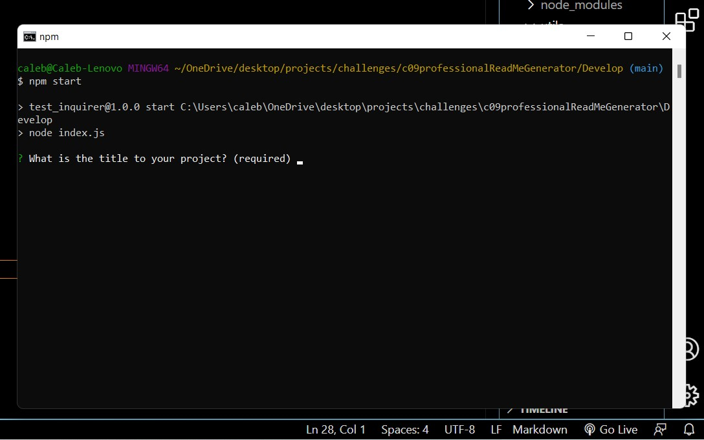
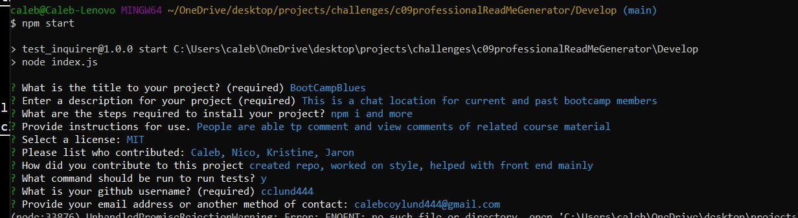

# Professional README Generator 

Purpose:
Easy and accesable way to generate standard readme. Generic baseline, input functions for changes to each assignment or any project. 

Built with:
* javaScript
* gitignore

Website:

https://cclund444.github.io/c09professionalReadMeGenerator/

Contibution:

Caleb Lund
(575) 937-3648
calebcoylund444@gmail.com
https://github.com/cclund444

image:

WalkThrough Video:

Side Setup notes:

[How to create a Professional README](./readme-guide.md)

